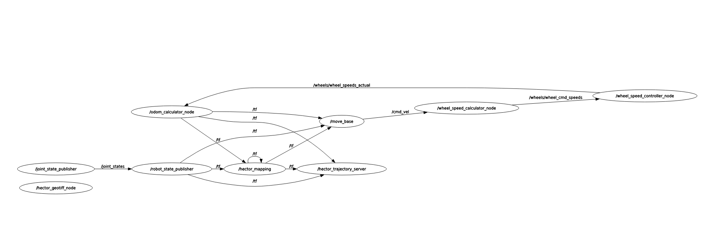
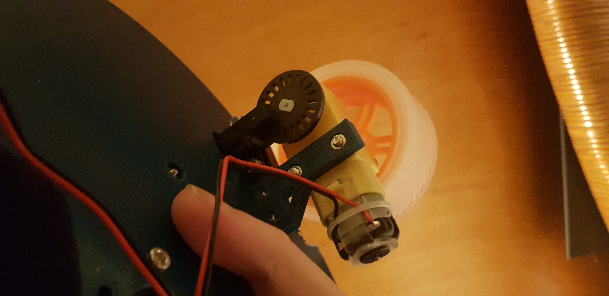
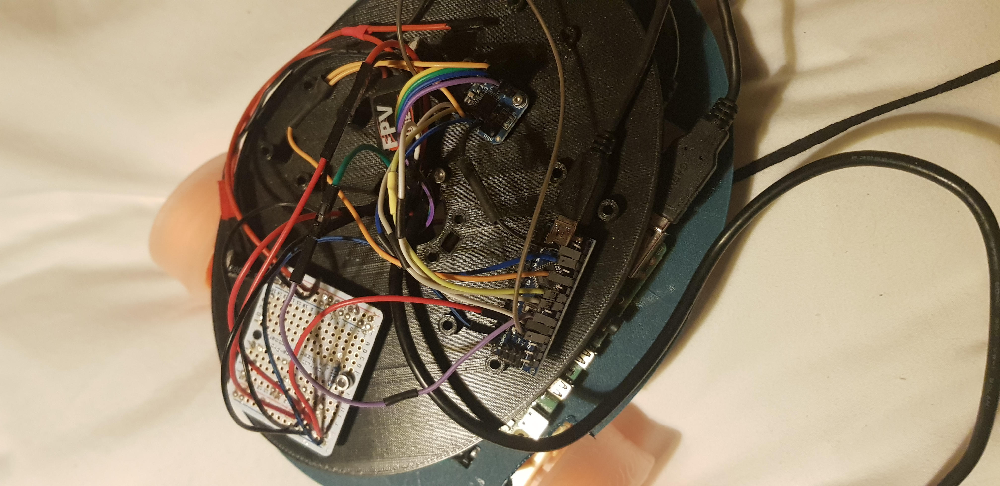
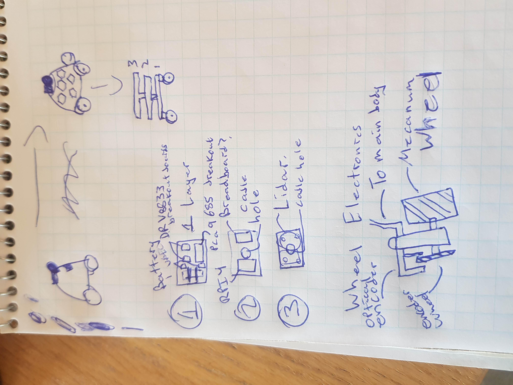
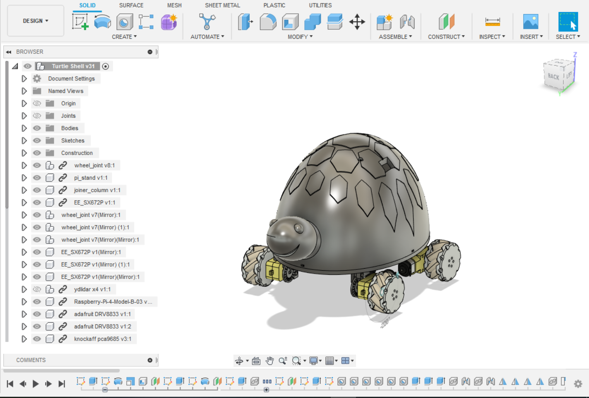
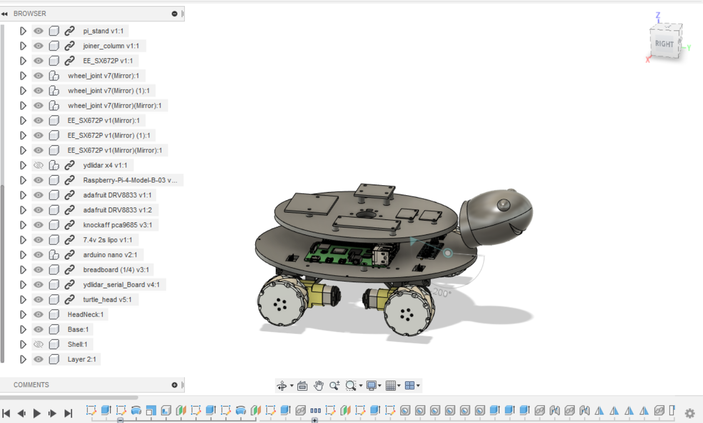

# auto_rover

this was a fun project where I made a wheeled ros based robot from scratch, including hardware, design, and substantial software for kinematics, control, and odometry (though I used existing SLAM and path planning packages).


this robot has support for differential drive (with 2 driven wheels), skid steering (with 4 driven wheels), and omni wheels.

This repo is structured as a catkin workspace, so you should just clone it with submodules, and use catkin to build the workspace. Then the main entry point is:  

```
roslaunch toulouse_rover toulouse.launch wheel_config_type:=differential_drive autonomous_mode:=false
```

For autonomous mode, i often used screen as a multi-terminal utility:

```
screen -d -m -S toul -L roslaunch toulouse_rover toulouse.launch autonomous_mode:=true wheel_config_type:=fixed_pwm_speeds
```

You can find a compressed bag demo in the root of this repo, `toulouse_autonomy_demo.bag` which shows a scene of me controlling the robot and sending it forward and then turning a bit. You can also find the log outputs of this run in the root of this repo, `toulouse_autonomy.log`.  

## Demo GIFs

## Software

  
Not pictured above is the lidar or the serial communicator node with the arduino.

You can run tests with:  

```
catkin_make run_tests toulouse_rover
```

I wrote software to do kinematics for the robot and calculate which speed wheels should turn out [WheelSpeedCalculator](src/toulouse_rover/include/toulouse_rover/wheel_speed_calculator.h) .  

I also wrote software to control the wheel speeds given encoder input, or to control the wheel speeds using a linear model to scale input from max to minimum speed [WheelSpeedController](src/toulouse_rover/include/toulouse_rover/wheel_speed_controller.h)).

I also wrote software to calculate robot position given the wheel rotation speeds, for example from encoder inputs [OdomCalculator](src/toulouse_rover/include/toulouse_rover/odom_calculator.h). I didnt end up using this as my encoders only had 20 ticks per revolution and I found it challenging to get the time step down enough to where I could rely on the output position.

The WheelSpeedCalculator listens to command velocities and then calculates what speeds wheels should turn. It then sends this to the WheelSpeedController, which calculates pwm speeds and sends this to an arduino that interfaces with the motor driver. The arduino sends the encoder data back, and this gets passed to the OdomCalculator.

I dont use the values published from OdomCalculator, instead I use Hector SLAM to publish odometry and map the room, and I use move_base to do path planning based on that. I publish command positions using rviz, and move_base publishes command velocities to achieve the goal pose.

You can find the ros package for toulouse [here](src/toulouse_rover/).

## Hardware

  


The basic hardware is all from Adafruit. The motors are yellow plastic TT Motors [here](https://www.adafruit.com/product/3777) and the motor drivers are dev boards based on the DRV8833 motor driver [here](https://www.adafruit.com/product/3297). This is all powered with a 2s LIPO at 7.4 volts, with two step down converters, one to the pi, one to the motors. The encoders are plastic encoder wheels with 20 ticks per rotation. A T slot IR interupt sensor was used to measure encoder ticks.

The brains is a Raspberry PI 4 with 4gb RAM, running ubuntu 20.04.

An Arduino Nano is used to measure the interupts from the IR sensor, as well as to send PWM to the motor driver boards. It talks to the Raspberry PI via Serial.

## Design

I wanted to build a robot with wheels, as I hadnt worked with them a lot. From there I did some sketches, and it evolved into a turtle robot with a lidar on its shell, with stacked layers inside letting me mount different electronics:


I tried to figure out what I would need on each layer, and what components I wanted to use for electronics. From here I started doing sketches in fusion 360...

I eventually had a full design with a turtle:
.

And all the electronics were hidden behind the shell:
.

You can find cad files [here](cad).

### Lessons Learned

This robot doesnt work well in autonomous mode. It was a good learning experience, but far from an end product...

## Odometry

I made some early decisions on hardware for odometry that came back to bite me...For example, the ir sensors I am using measure interupts in the path of the ir light, and the wheels with holes in them i use to interupt the ir sensor only have 20 ticks per rotation. This is challenging to use for odometry because if my motors are doing 2 revolutions per second, i get 40 ticks per second. There is noise to all sensors, including my ir sensors, and if I sample those 40 ticks per second 10 times a second, I get 4 ticks per sample. If both wheels are turning at roughly the same speed, i could still see cases where i get 3 ticks on my left wheel, and 5 on the other due to sensor noise or sampling noise. When I input this into my odometry i get pretty bad errors as it thinks the robot is turning to the left for that time frame. I eventually just used Lidar Odometry from the hector_slam package. In the future, I would use motors with built in magnetic encoders to help me with direction of the wheel spin, and also ensure high enough resolution encoders to use for odometry.

The other aspect is that with such low resolution on my encoders, I found speed control of my motors to be challenging. I would like to use the encoders to also control how fast my wheels are turning, so the magnetic encoders with higher resolution should help with that in the future.

## Front Wheel
The front wheeel I had on the rover was pretty sturdy and given my motors were weak i could actually get thrown off my course by it. For example if the wheel was pointing left and i tried to go forward, my robot would tilt forward left instead of straight forward.

To fix this, I could use a gearing system on my current motors to give them more torque and slow them down, or use different motors or a different front wheel, like a ball one.


## Lidar Power Consumption

It takes a substantial amount of current to start the Lidar spinning and my raspberry pi cant deliver that from its USB 3.0 socket. I ended up plugging in a portable power bank, like the kind you use to recharge your phone, at startup so that the lidar could draw off of that. Then I unplugged the power bank once the lidar was spinning to run autonomously. I'd like to design a better power system that can handle the lidar current, and also has some safety measures built in like monitoring the Lipo and shutting down if the battery is too low.

## Better Cable Connections

I used mostly dupont cables in this project, which come unconnected quite easily. I'd like to switch to jxt or something that stays connected and is similarly easy to unplug and re-plug.  

## More support for wheels
The way I designed the wheels, they only were attached to the body by a thin strip of plastic running in the plane from forward to backward. The wheels started to bow outward under the weight of the robot. I would design a better bracing system for the wheels that braced them forward backward as well as side to side, and perhaps connected them to each other.  
